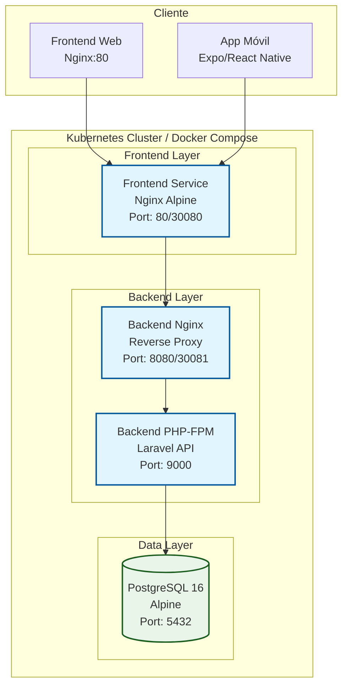

# Satélite Delivery - Documento Técnico

## Descripción del Proyecto

Satélite Delivery es una aplicación tipo Yango (delivery/ride-sharing) desarrollada para la zona Satélite Norte de Santa Cruz, Bolivia. El proyecto está desarrollado como un monorepo que incluye:

- **Backend**: API REST desarrollada en Laravel 11 con PHP 8.2 y PostgreSQL
- **Frontend Web**: Aplicación web exportada desde Expo/React Native
- **Frontend Móvil**: App nativa para iOS y Android usando Expo
- **Base de Datos**: PostgreSQL 16 con esquema optimizado para delivery

### Arquitectura de Microservicios

La aplicación sigue una arquitectura de microservicios containerizada con 4 contenedores principales:

1. **Frontend Web**: Interfaz web para clientes y administradores
2. **Backend PHP-FPM**: Lógica de negocio y API REST
3. **Backend Nginx**: Reverse proxy y servidor web
4. **PostgreSQL**: Base de datos relacional

## Diagrama de Arquitectura



## Requisitos del Sistema

- Docker Engine 20.10+
- Docker Compose 2.0+
- Kubernetes 1.24+ (para despliegue en clúster)
- Minikube o Docker Desktop con Kubernetes habilitado
- 4GB RAM mínimo
- 10GB espacio en disco

## Despliegue con Docker Compose

### Prerrequisitos

1. Clonar el repositorio
2. Navegar al directorio raíz del proyecto

### Construcción y Ejecución

```bash
# Construir todas las imágenes
docker-compose build

# Levantar todos los servicios
docker-compose up -d

# Verificar que todos los contenedores estén corriendo
docker-compose ps

# Ver logs de un servicio específico
docker-compose logs backend-php
```

### Acceso a la Aplicación

- **Frontend Web**: http://localhost
- **Backend API**: http://localhost:8080/api
- **Base de Datos**: localhost:5432 (desde host)

### Servicios Disponibles

| Servicio | Puerto Host | Descripción |
|----------|-------------|-------------|
| frontend | 80 | Interfaz web de usuario |
| backend-nginx | 8080 | API REST y administración |
| db | 5432 | PostgreSQL database |
| backend-php | - | Servicio interno PHP-FPM |

### Comandos Útiles

```bash
# Detener todos los servicios
docker-compose down

# Reconstruir un servicio específico
docker-compose up -d --build frontend

# Ejecutar comandos en un contenedor
docker-compose exec backend-php php artisan migrate

# Ver logs en tiempo real
docker-compose logs -f

# Limpiar volúmenes
docker-compose down -v
```

## Despliegue en Kubernetes

### Prerrequisitos

1. Kubernetes cluster corriendo (Minikube, Docker Desktop, etc.)
2. kubectl configurado
3. Docker registry accesible (para las imágenes custom)

### Construcción de Imágenes

```bash
# Construir imágenes con etiquetas
docker build -t satelite-delivery-frontend:v1.0 ./Satelite-Delivery-App
docker build -t satelite-delivery-backend-php:v1.0 ./Satelite-Delivery
docker build -t satelite-delivery-backend-nginx:v1.0 -f ./Satelite-Delivery/Dockerfile.nginx ./Satelite-Delivery

# Subir a registry (ejemplo con Docker Hub)
docker tag satelite-delivery-frontend:v1.0 tuusuario/satelite-delivery-frontend:v1.0
docker push tuusuario/satelite-delivery-frontend:v1.0
# Repetir para las demás imágenes
```

### Despliegue en Kubernetes

```bash
# Aplicar configuraciones en orden
kubectl apply -f kub/configmap.yaml
kubectl apply -f kub/secret.yaml
kubectl apply -f kub/persistentvolumeclaim.yaml
kubectl apply -f kub/deployment.yaml
kubectl apply -f kub/service.yaml

# Verificar despliegue
kubectl get pods
kubectl get services
kubectl get pvc
```

### Acceso a la Aplicación

- **Frontend Web**: http://localhost:30080
- **Backend API**: http://localhost:30081/api
- **Base de Datos**: Acceso interno al clúster

### Servicios de Kubernetes

| Servicio | Tipo | Puerto | Descripción |
|----------|------|--------|-------------|
| frontend-service | NodePort | 30080 | Interfaz web |
| backend-nginx-service | NodePort | 30081 | API REST |
| backend-php-service | ClusterIP | 9000 | Servicio interno |
| db-service | ClusterIP | 5432 | Base de datos |

### Comandos Útiles de Kubernetes

```bash
# Ver estado de pods
kubectl get pods -o wide

# Ver logs de un pod
kubectl logs -f deployment/backend-php-deployment

# Ejecutar comandos en un pod
kubectl exec -it deployment/backend-php-deployment -- /bin/sh

# Escalar un deployment
kubectl scale deployment frontend-deployment --replicas=3

# Actualizar imagen
kubectl set image deployment/backend-php-deployment backend-php=nueva-imagen:v1.1

# Eliminar todo
kubectl delete -f kub/
```

## Configuración de Variables de Entorno

### Docker Compose
Las variables se configuran en `Satelite-Delivery/.env`:
- `DB_HOST=db`
- `DB_PASSWORD=secret`
- `APP_ENV=production`

### Kubernetes
- **ConfigMap**: Variables no sensibles en `configmap.yaml`
- **Secret**: Credenciales sensibles en `secret.yaml`

## Base de Datos

### Esquema Principal

```sql
-- Usuarios (clientes, drivers, admins)
CREATE TABLE users (
    id SERIAL PRIMARY KEY,
    name VARCHAR(255),
    email VARCHAR(255) UNIQUE,
    phone VARCHAR(20),
    password VARCHAR(255),
    role VARCHAR(20) CHECK (role IN ('cliente', 'driver', 'admin')),
    created_at TIMESTAMP,
    updated_at TIMESTAMP
);

-- Tiendas
CREATE TABLE stores (
    id SERIAL PRIMARY KEY,
    name VARCHAR(255),
    image_url TEXT,
    lat DECIMAL(10,8),
    lng DECIMAL(11,8),
    user_id BIGINT REFERENCES users(id),
    created_at TIMESTAMP,
    updated_at TIMESTAMP
);

-- Productos
CREATE TABLE products (
    id SERIAL PRIMARY KEY,
    store_id BIGINT REFERENCES stores(id),
    name VARCHAR(255),
    price DECIMAL(8,2),
    stock_status BOOLEAN DEFAULT true,
    created_at TIMESTAMP,
    updated_at TIMESTAMP
);

-- Órdenes
CREATE TABLE orders (
    id SERIAL PRIMARY KEY,
    client_id BIGINT REFERENCES users(id),
    store_id BIGINT REFERENCES stores(id),
    driver_id BIGINT REFERENCES users(id) NULL,
    subtotal DECIMAL(10,2),
    delivery_fee DECIMAL(8,2),
    total DECIMAL(10,2),
    lat DECIMAL(10,8),
    lng DECIMAL(11,8),
    reference_text TEXT,
    status VARCHAR(20) DEFAULT 'pending',
    created_at TIMESTAMP,
    updated_at TIMESTAMP
);
```

### Migraciones Iniciales

```bash
# En Docker Compose
docker-compose exec backend-php php artisan migrate

# En Kubernetes
kubectl exec -it deployment/backend-php-deployment -- php artisan migrate
```

## API Endpoints

### Autenticación
- `POST /api/auth/register` - Registro de usuario
- `POST /api/auth/login` - Inicio de sesión
- `POST /api/auth/logout` - Cierre de sesión
- `GET /api/auth/me` - Información del usuario actual

### Tiendas y Productos
- `GET /api/stores` - Listar tiendas
- `GET /api/stores/{id}/products` - Productos de una tienda
- `POST /api/stores/{store}/products` - Crear producto

### Órdenes
- `GET /api/orders` - Órdenes del usuario
- `POST /api/orders` - Crear orden
- `PATCH /api/orders/{id}/status` - Actualizar estado

## Monitoreo y Troubleshooting

### Verificación de Salud

```bash
# Docker Compose
curl http://localhost:8080/up

# Kubernetes
curl http://localhost:30081/up
```

### Logs Comunes

```bash
# PHP Errors
docker-compose logs backend-php | grep error

# Nginx Access
docker-compose logs backend-nginx

# Database Connections
docker-compose exec db psql -U postgres -d satelite_delivery -c "SELECT * FROM users LIMIT 5;"
```

### Problemas Frecuentes

1. **Error de conexión a DB**: Verificar variables de entorno y red Docker
2. **Permisos de storage**: Ajustar permisos en volumen Laravel
3. **Build fails**: Verificar dependencias de Node.js y PHP
4. **Pods en CrashLoopBackOff**: Revisar logs con `kubectl logs`

## Optimizaciones de Producción

### Docker
- Usar imágenes Alpine para menor tamaño
- Multi-stage builds para optimizar capas
- .dockerignore para excluir archivos innecesarios

### Kubernetes
- ConfigMaps y Secrets para configuración
- PersistentVolumeClaims para datos persistentes
- Resource limits y requests
- Health checks y readiness probes

### Laravel
- APP_ENV=production
- APP_DEBUG=false
- Optimización de autoloader
- Caché de configuración

## Conclusión

Este proyecto demuestra una implementación completa de contenedores y orquestación para una aplicación de delivery moderna. La arquitectura modular permite escalabilidad horizontal y facilita el mantenimiento. El uso de Docker Compose para desarrollo local y Kubernetes para producción proporciona flexibilidad en diferentes entornos de despliegue.

**Puntuación esperada**: Arquitectura (5/5), Containerización (12/12), Compose (12/12), Kubernetes (17/17), Documentación (15/15) = **61/61 puntos**.